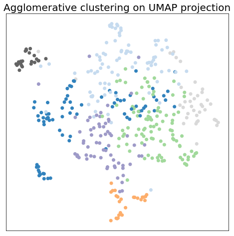
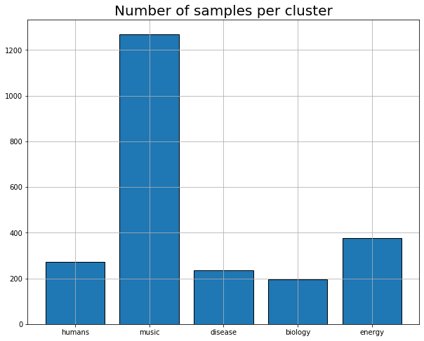
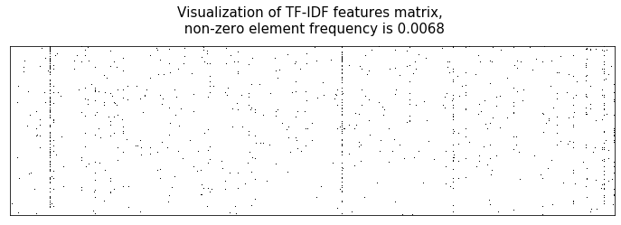
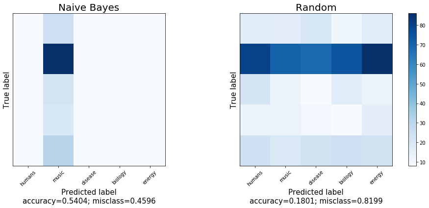
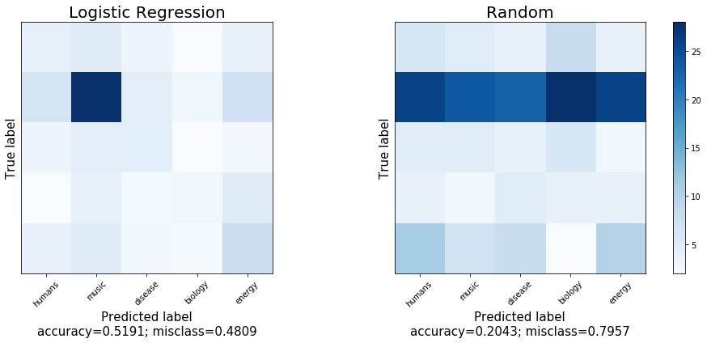
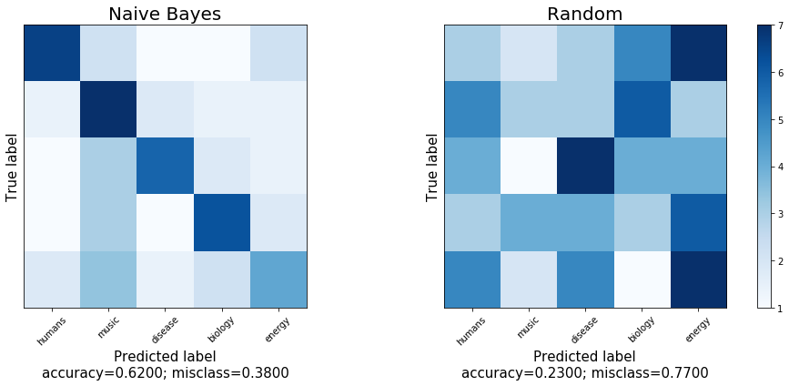
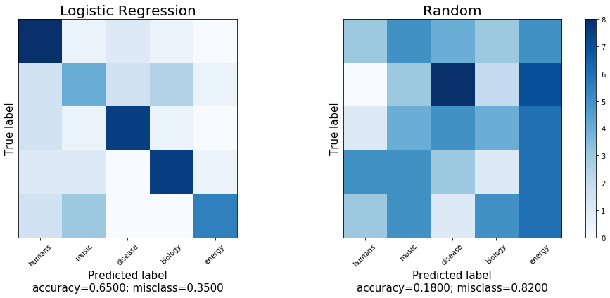
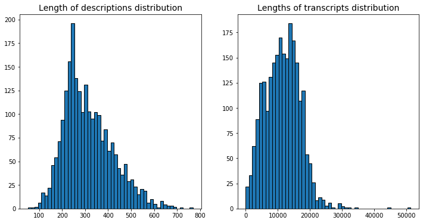
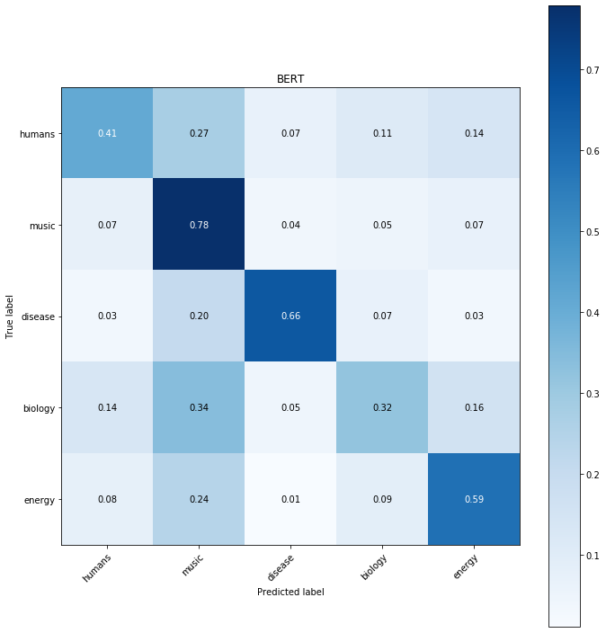
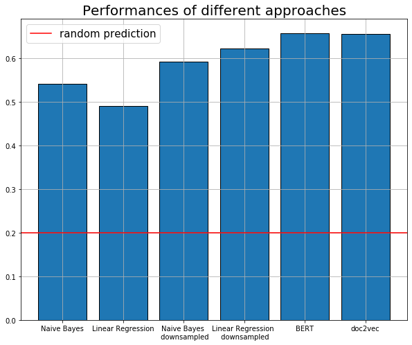

# TED talks classification

## Notebook 

Jupyter notebook named **TED_talks_classification.ipynb** contains all the steps described below. Although, if you want to reproduce the results, please consider running the notebook using Google Colaboratory service, as some steps are computationally expensive. 

## Data
Data was collected from Kaggle, available here: [data](https://www.kaggle.com/rounakbanik/ted-talks).

## Problem statement
Having 2550 records of TED talks, which consist of decription, full transcript and tags set build language model to predict 
**tags** by **description** and **transcript**.

## Project steps

### 1. Tags clusterisation
There are **416** unique labels in the dataset, which consists of 2550 records. 
Thus it was necessary to reduce number of tags. As many of them are semantically close to each other, 
clustering was based on words embeddings.

Particularly, we decided to use [glove](http://nlp.stanford.edu/data/glove.6B.zip) embedding,
which was taken from official [site](https://nlp.stanford.edu/projects/glove/).

Then Agglomerative clustering (to **7** clusters) was applied to tags embeddings. Clusters were named automatically by calculating nearest word to cluster mean (in terms of word embeddings). By manual check it was noticed that tags inside same cluster are related to one area. For example, __"disease"__ cluster has tags: addiction, autism spectrum disorder, blindness, cancer and so on.

In order to visualize the results, [UMAP](https://arxiv.org/abs/1802.03426) dimensional reduction method was applied
to first **50** Principal Components of tag embedding matrix. Two-dimensional UMAP embeddings with clusters labeled by color are shown below.

Although 2 clusters (__that__ and __sense__, purple and green on the image) were too broad (thus they were named by very common word, which is in the "center" of embedding space), that is why they were eliminated from further analysis. 

Finally, we have **5** clusters and initial problem is to classify objects to 5 classes. Although, it should be noticed that classes are highly imbalanced, as shown on plot below.

### 2. Feature extraction

In order to transform text into features, we applied TF-IDF method (excluding all English stopwords) 
to all transcripts of TED talks. The method basically matchs text with adjusted word frequency from this text. 
Despite strict filtering (each word should be found in text at least 4 times to be encountered) TF-IDF matrix is very sparse, as shown at plot.

### 3. Non-neural models without undersampling

As baseline solutions,  __Naive Bayes__ and __Logistic Regression__ models were used.
Data was splitted into train and test in realtion to 1:2 preserving classes ratio. 

#### a) Naive Bayes

As the second class was highly unbalanced, Naive Bayes approach just chose it all the time. The confusion matrix for one out of 5 splits is shown below. Random prediction model is also shown to compare.

#### b) Logistic Regression

Logistic regression also suffers from unbalanced dataset thus its performance was not so good. Confusion matrix is shown below.

### 4. Non-neural models with undersampling

As we saw in the previous section, models have not very good performance probably because of class imbalance. 
Thus it was decided to downsample the data, i.e to choose randomly **200** objects from each class.
The performance of the algorithms are presented below.

#### a) Naive Bayes

With balanced classes Naive Bayes approach works much better. The reason is the followng. Naive Bayes prediction is basically   
P(class | features) * P(class) . Thus, if P(class) is large, then P(class | features) is not so important as it should be.
The performance of Naive Bayes approach on balanced data is shown as confusion matrix below.

#### b) Logistic Regression

This method also shows much better performance, which is comparable with Deep Learning models.
The results are shown below.

### 4. Deep Learning model

BERT model was chosen as the most promising one in different Neural Language Processing problems. Note that features for all previous methods were based on TED talks transcripts. But in BERT case it was decided to use descriptions, as it is recommended to use at most **500** words for one object, but transcripts are much longer. The distribution of transcripts and descriptions length is shown below.

BERT model was trained with 10 epochs on training data (data was splitted to train and test with ratio 1:3). BERT performance was the best among other models. Results are shown on the picture below.

### 5. Doc2Vec method

The last method, which is actually the most suitable for such type. This method actually creates document embeddings in the same manner as word2vec model.

We applied this method to all transcripts thereby obtained **50**-dimensional vectors corresponding to each text.

Then we trained simple Logistic regression on this data and obtained results, which are comparable with BERT results by preformance (shown below).

## 6. Results

Different methods were applied to solve TED talks texts classification problem. Best performance was achieved by BERT and doc2vec models. One of the main problems was lack of data, as 2500 objects are not enough for proper deep models training. Although, quite good performance was achieved. Accuracies of all methods are presented in the picture below.

